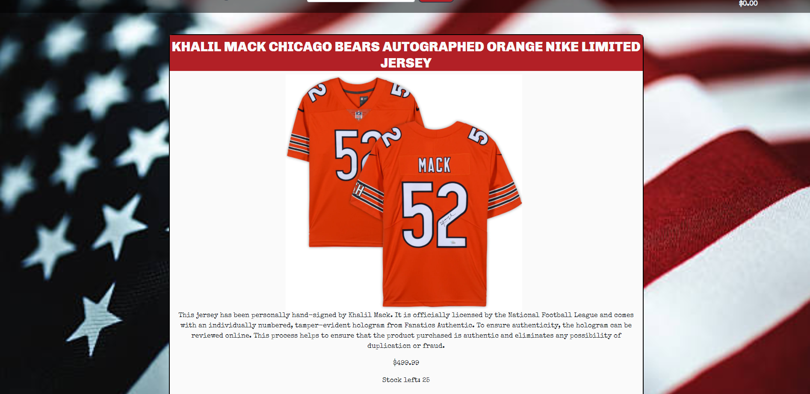
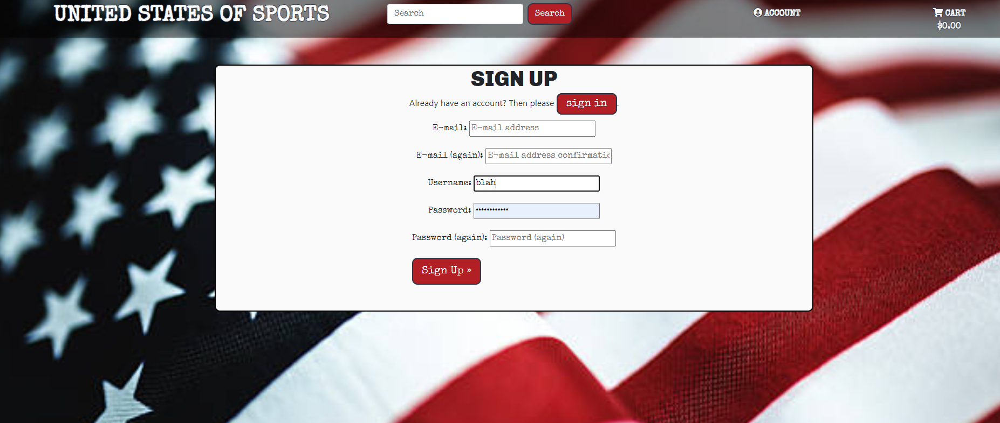
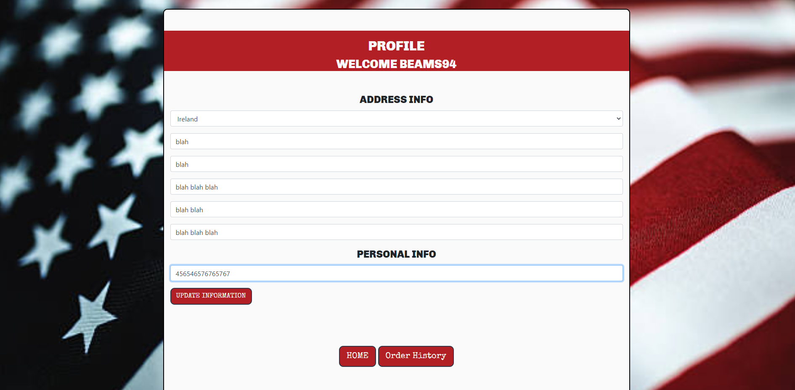
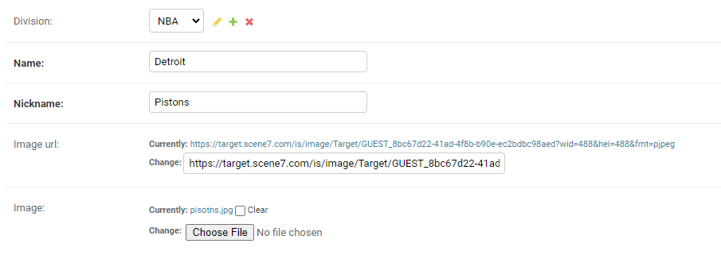

# Intro and Strategy
This website is a Sports Memorabilia e-commerce website, where users can search through, leagues and teams memorabilia and buy them.
Users can create profiles which will save their billing info for future purchases and save their order history. The overall goal of the website
is to provide a platform for users to search for american sports memoribila and purchase it. 

# User Stories

## Story 1

A user will be able to search through the relavent leagues by team on the home page with a dropdown, scroll menu or through
the search bar both which are located on the home page of the website as shown in image a). Once they have selected a team or
searched for an item the merchandise will be layed out as seen on image b) i which users can selected their prefered merchandise
and be taken to the individual merchandise page as seen on images ci) cii). Here a user can choose the quantity they would like and add it
too their cart for purchase. viewing the cart will always be possible on all screens by clicking the cart link in the navagation bar
 and will look like image d). Users can then checkout by clicking the secur checkout button and be taken to the checkout page to
complete the form for payment as seen on image e). On this page they cna also save used info to their profile if they are logged in.
Finally once complete they will be taken to the order success page as seen on image f), which will have their order details,
billing address and a confirmation that they have been sent an email. 

### a)

### b)

### ci)

### cii)

### d)

### e)

### f)

## Story 2

User's can also create profiles which can be used to store billing info such as address and phone numbers and let the user view his order-history.
user just has to click register on the account section of the navbar and will be takento a register page as seen on image a) below. Once filled 
out they will need to confirm their email address and will then have the ability to add info to their profile. the layout for their profile page
can be seen in image b) with address info and perosnal ifo sections aswell as a button to take you to order history if they have one. 

### a)

### b)

# Scope

# Structure

## The Database Structure
The main database models are Merchandise, Team, League, UserProfile (user) and orders. On the admin screen staff and superusers can add, delete, update and read merchandise, teams,
leageus and order info. For User info they can only see who is registered an account and their email but profile info can only be edited on the my profile page or if payment info is saved to profile.
The merchandise model is connected to the team modles through a foreign key aswell as the league. The team model has a foreign eky connection to the league model aswell. This allows 
merchandise to connec to the respective pages of the teams and leagues which helps searching for them. 
When an order is made if the user is logged the order will have a foreign key attaching to the user profile allowing the user to view the details in order history at anytime, if they are not logged in this
field will be left null.

### Merchandise

The Merchandise model as said before is connected to league and team. It also has boolean fields for game-used or if the merchandise is signed which is used for filters. Stock field prevents
users from entering larger quantity then what is in stock. Name and description fields can be used for search and we've made a custom sku for all merchandise. 

### Teams and Leagues

Both the league and the team are used as ways of filtering merchanidse aswell as keys for the merchandise to be allocated correctly. In league there is a font-awesome class aswell 
for display purposes, in the team model nickname and images are fields, the nickname's to differnetiate the different teams from the same city and the images are used as background
for the team pages. 

### User Profiles and Orders 

# Skeleton 

[index page](./media/wireframe-index.png)

[team page](./media/wireframe-team.png)

[merch page](./media/wireframe-individual-merch.png)

# Surface

# Features

## Future Features

# Technologies 

1) HTML

2) CSS

3) Django

4) Python

5) Javascript
 
6) Bootstrap

7) Stripe

8) AWS

# Testing

Display, images and links worked fine on google chrome, firefox and microsoft edge. 
Used W3 validator for css and html and the pep8.com to check the python was displayed up 
to standard. On each browser check we tested on mobile view(iphone 6/78), ipad view on 
both rotations and on general browser view. On Checkout views.py, webhookhandler.py, 
webhooks.py and in setting.py all have one or two lines that are two long accoridng to pep8 but 
we determined that for readability and functionality that those respective lines would be left as is. 

# Deployment

The project was completed on gitpod and deployed on heroku. To connect our gitpod to heroku we
first created an app which we called ‘united-states-of-sports’. After this we associate the heroku
app with our master repository so that we can push our work on to Heroku. For this to work we had
to first create a Procfile in gitpod which is like an instructor to heroku on which files it needs
to run the project. 

All static files where stored on AWS in which the s3 bucket was connected through aws-access-key and
aws-secret-key. 

# Credits

# Acknowledgements

# Media
